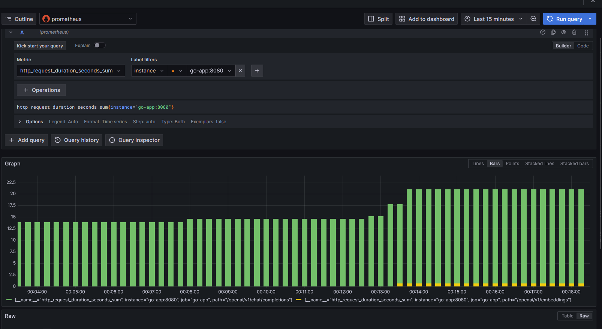
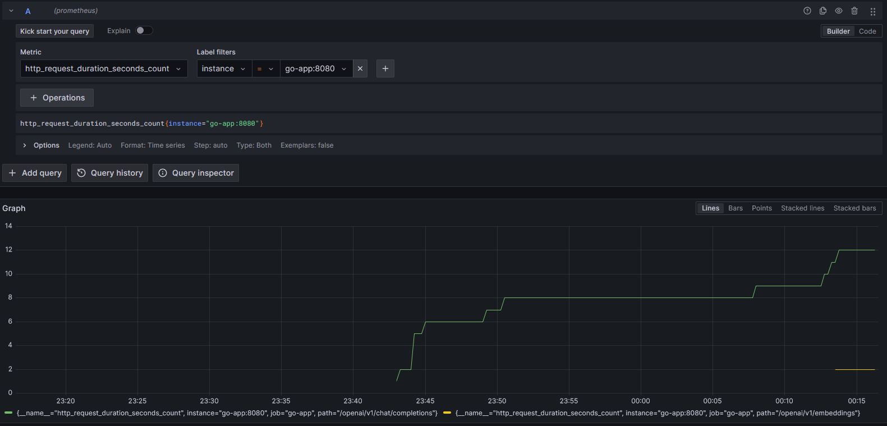

# Go Proxy for OpenAI API with Prometheus Monitoring

This project is a Go-based HTTP proxy server that routes requests to the OpenAI API. It includes Prometheus instrumentation for monitoring request latency and total request counts, and a Docker setup for running the application along with Prometheus and Grafana. This setup helps in assessing the performance of OpenAI API calls through the proxy.

## Features

- Forward HTTP requests to the OpenAI API.
- Collect Prometheus metrics for observability.
- Visualize metrics using Grafana.
- Containerized setup using Docker and Docker Compose.

## Prerequisites

- Docker
- Docker Compose
- Go (for building the application locally)


## Preview from grafana





## Getting Started

### Clone the Repository

```bash 
git clone https://github.com/yourusername/go-openai-proxy.git cd go-openai-proxy 
```

### Build and Run the Application

1. **Build the Docker Image:**

bash docker build -t go-app .


2. **Run the Docker Compose Setup:**

bash docker-compose up --build

### Accessing the Services

- **Go Application:** [http://localhost:8080](http://localhost:8080)
- **Prometheus:** [http://localhost:9090](http://localhost:9090)
- **Grafana:** [http://localhost:3000](http://localhost:3000)
  - Default credentials: `admin` / `admin` (change after login)

## Configuration

### Prometheus

Prometheus is configured to scrape metrics from the Go application every 5 seconds. The configuration file (`prometheus.yml`) is provided and mounted into the Prometheus container.

### Grafana

Grafana is pre-configured to connect to Prometheus, but you will need to create your own dashboards to visualize metrics. 

## Example Usage

### Making Requests Through the Proxy

You can use tools like `curl` to make a request through the proxy:

```bash
curl -X POST http://localhost:8080/openai/v1/engines/davinci-codex/completions \ -H "Authorization: Bearer YOUR_OPENAI_API_KEY" \ -H "Content-Type: application/json" \ -d '{ "prompt": "The quick brown fox", "max_tokens": 50 }'
```

This request will be proxied to the OpenAI API, and metrics will be collected regarding the request's latency and success status.

### Viewing Metrics

1. **Prometheus Interface:**
   - Navigate to [http://localhost:9090](http://localhost:9090) to access the Prometheus web UI.
   - Use queries such as `http_requests_total` and `http_request_duration_seconds` to see raw metrics.

2. **Grafana Dashboards:**
   - Navigate to [http://localhost:3000](http://localhost:3000) to access the Grafana web interface.
   - Create a new dashboard, add panels, and use the Prometheus data source with queries like:
     - `rate(http_request_duration_seconds_sum[1m])`
     - `rate(http_requests_total[1m])`


### Observability Example

By monitoring the following metrics, you can gain insights into the performance of the OpenAI API calls made through the proxy:

- `http_request_duration_seconds`: Histogram of request latencies.
- `http_requests_total`: Counter for total number of requests.

For example, to monitor the average request duration over the last minute, you can use the following Prometheus query in Grafana:

prometheus rate(http_request_duration_seconds_sum[1m]) / rate(http_request_duration_seconds_count[1m])


This setup helps in identifying performance bottlenecks and ensures that the OpenAI API is performing optimally when accessed via the proxy.

## Files in the Repository

- **main.go:** The main Go application code.
- **Dockerfile:** Dockerfile for creating the Go application image.
- **docker-compose.yml:** Docker Compose configuration to set up the Go app, Prometheus, and Grafana.
- **prometheus.yml:** Configuration file for Prometheus.


## Planned Improvements
- make the proxy compatible with `openai` sdk
- Add more providers for monitoring
- Add more metrics for monitoring

## Conclusion

This project provides an easy-to-deploy solution for proxying HTTP requests to the OpenAI API while monitoring performance metrics using Prometheus and Grafana. It ensures that you can track and visualize key metrics to maintain optimal API performance.

## License

This project is licensed under the MIT License.

Save the above content into a file named README.md. This Markdown documentation includes all essential instructions for setting up and using the Go proxy application with Prometheus and Grafana for monitoring OpenAI API performance.